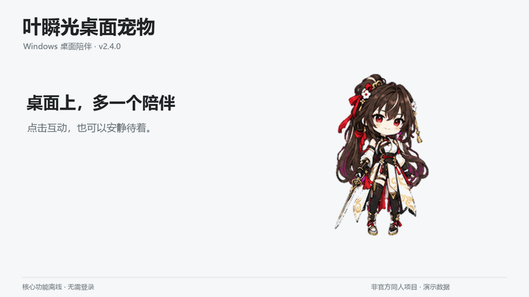

# 叶瞬光桌面宠物

可换角色的离线桌面陪伴，带迷你番茄钟和学习记录。无需登录，不需要安装额外运行库。

**[下载 Windows 便携版](https://github.com/Resker666/YeShunguangPet/releases/latest)** · [三步启动](#三步启动) · [完整使用说明](docs/USER_GUIDE.md) · [反馈体验](https://github.com/Resker666/YeShunguangPet/issues/new?template=trial_feedback.yml)

演示基于 v2.4.0 的原生界面与原始动作帧，使用独立演示数据。[查看高清演示](docs/media/demo-30s.mp4) · [素材说明](docs/promotion/MEDIA_NOTES.md)

这是非官方、非商业的同人项目，与米哈游或 HoYoverse 没有从属、赞助或授权关系。角色图像不属于程序代码的 MIT 授权范围，请阅读[素材与权利说明](ASSET_NOTICE.md)。

## 可以做什么

| 桌面陪伴 | 迷你番茄钟 | 换成喜欢的角色 |
| --- | --- | --- |
| 拖动、点击互动、贴边收纳；最多同时保留 3 个角色 | 调整专注与休息时间，收起成可置顶的小窗，保存完成记录 | 预览并导入皮肤 ZIP，用动作编辑器微调现有皮肤 |

核心功能离线运行。角色台词是可编辑的本地短句，不是联网 AI 聊天；制作新皮肤所用的外部 AI 工具另算。

## 三步启动

1. 打开[下载页面](https://github.com/Resker666/YeShunguangPet/releases/latest)，在 **Assets** 中选择名称以 `win-x64-portable.zip` 结尾的文件，不要选 `Source code`。
2. **完整解压 ZIP** 到一个固定文件夹，不要直接在压缩包里运行。
3. 双击 `YeShunguangPet.exe`。旁边的 **`Pets` 文件夹要一起保留**。

支持 **Windows 10 / 11 x64**，无需管理员权限。当前不提供 macOS、Linux 或原生 ARM64 版。

> 当前版本尚无商业代码签名，Windows 可能显示“未知发布者”等提示。请先确认来自本仓库的 Release，并核对同一页面的 SHA256 文件。不要为了试用关闭系统安全防护；无法确认来源时先停止运行并反馈。

升级前先从系统托盘退出旧版，再解压运行完整的新包；旧版仍运行时，再次打开 EXE 只会唤醒旧进程。

## 第一次可以这样试

- **移动和互动**：拖动角色；单击打招呼，双击跳跃。
- **开始专注**：右键角色 → 学习陪伴。右上角可切换迷你模式，图钉控制迷你钟置顶。
- **查看介绍**：右键 → 查看角色介绍，只读，不会关闭角色。
- **添加或切换角色**：右键 → 角色管理；皮肤导入入口在“设置 → 皮肤”。
- **找不到角色**：按 `Ctrl + Alt + Y` 召回，或从系统托盘打开角色管理。
- **完全退出**：在系统托盘或角色右键菜单中选择“退出程序”。关闭计时面板不会停止计时。

## 想制作自己的皮肤

已经有皮肤包时，可导入单个角色 ZIP 或 `pet.json`。只有一张立绘还不够，动画需要精灵图与动作参数。

[用 AI 制作皮肤的步骤与提示词](docs/AI_SKIN_GUIDE.md) · [皮肤包格式](docs/PET_FORMAT.md) · [动作编辑器](docs/USER_GUIDE.md#动作配置编辑器)

## 反馈与试用

独立开发，欢迎告诉我哪里好用、哪里让你不想继续用。

- [反馈一次使用体验](https://github.com/Resker666/YeShunguangPet/issues/new?template=trial_feedback.yml)：安装是否顺利、用过什么、希望改哪一点。
- [报告 Bug](https://github.com/Resker666/YeShunguangPet/issues/new?template=bug_report.yml)：附版本、复现步骤和显示环境。
- 出错时可在“设置 → 关于 → 诊断与日志”导出脱敏诊断包，**检查内容后再决定是否附上**。不必为了反馈先删除配置。

GitHub Issue 默认公开，不要上传个人桌面、密码、密钥、工作文件或未经检查的日志。没有 GitHub 账号时，也可直接回复你看到本项目的演示帖。

## 更多说明

| 文档 | 内容 |
| --- | --- |
| [完整使用说明](docs/USER_GUIDE.md) | 多角色、菜单、贴边收纳、计时、台词、学习记录、升级和卸载 |
| [常见问题](docs/USER_GUIDE.md#常见问题) | 无法拖动、找不到角色、快捷键与异常处理 |
| [备份与恢复](docs/USER_GUIDE.md#备份与恢复) | 皮肤历史版本与恢复 |
| [开发与构建](docs/USER_GUIDE.md#开发与构建) | .NET SDK、本地测试、便携包及自动发布 |
| [更新记录](CHANGELOG.md) | 各版本新增与修复 |

程序源代码使用 [MIT License](LICENSE)，角色素材与宣传演示中的第三方视觉内容不包含在该许可中，详见 [ASSET_NOTICE.md](ASSET_NOTICE.md)。
