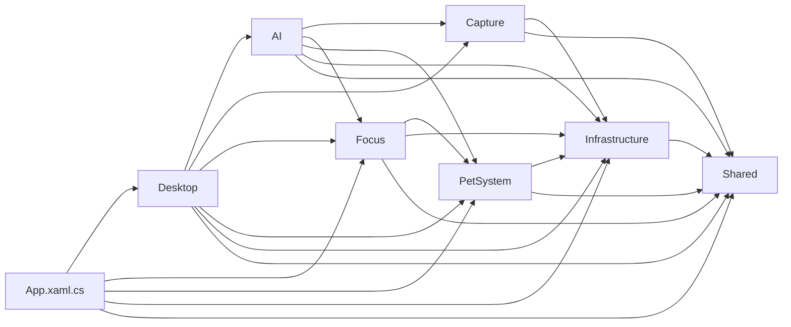

# 模块依赖审计

本图描述同一 `YeShunguangPet` 程序集内的源码所有权。箭头 `A → B` 表示 A 可以引用 B；目录不是独立程序集，边界由代码审查和 `ArchitectureTests` 共同维护。

## 直接依赖

| 模块 | 允许直接依赖 | 说明 |
| --- | --- | --- |
| `Shared` | 无 | 外观、动效和应用数据路径等无业务状态的共享类型 |
| `Infrastructure` | `Shared` | 日志、原生 API、异常处理、更新检查和通用对话框 |
| `PetSystem` | `Infrastructure`, `Shared` | 角色包、动画、行为、皮肤编辑和角色资源管理 |
| `Focus` | `PetSystem`, `Infrastructure`, `Shared` | 计时状态、记录和窗口；通过 `IStudySummaryService` 接受可选总结实现 |
| `Capture` | `Infrastructure`, `Shared` | 截图、标注、贴图和 OCR；通过 `ICaptureTextProcessor` 接受可选文字处理实现 |
| `AI` | `Capture`, `Focus`, `PetSystem`, `Infrastructure`, `Shared` | Provider、设置和聊天，并实现截图与专注模块声明的 AI 端口 |
| `Desktop` | 全部功能模块 | 应用组合层、桌面窗口、托盘、控制中心、诊断和跨模块工作流 |
| `App.xaml.cs` | `Desktop`, `Focus`, `PetSystem`, `Infrastructure`, `Shared` | WPF 进程入口和顶层生命周期组合 |

## 本轮修正

| 原依赖 | 问题 | 处理 |
| --- | --- | --- |
| `Focus → AI` | 专注历史窗口直接创建 Provider、Prompt 和建议服务 | `Focus` 声明 `IStudySummaryService`，`AI` 提供 `AiStudySummaryService` |
| `Capture → AI` | 截图文字助手直接理解 Provider 和流式协议 | `Capture` 声明 `ICaptureTextProcessor`，`AI` 提供 `AiCaptureTextProcessor` |
| `Focus/PetSystem → Desktop` | 静默时段和角色运动混在桌面工具类中 | 分离为 `QuietHours` 与 `PetMotion`，由职责所属模块维护 |
| `PetSystem → Desktop` | 控制中心持有 `DesktopSession` 和 `MainWindow`，却位于角色核心目录 | 将 `PetManagerWindow` 归入 `Desktop` |
| `Infrastructure → Desktop/PetSystem` | 诊断 UI、运行采样和报告直接读取桌面会话与角色状态 | 将诊断工作流归入 `Desktop/Diagnostics` |
| `Infrastructure/AI → PetSystem` | 日志和 AI 存储通过 `PetSettings` 获取应用目录 | 提取无业务依赖的 `Shared/AppPaths` |

## 自动边界

`tests/ArchitectureTests.cs` 在所有测试入口执行，检查：

- 根目录只保留 `App.xaml.cs` 作为组合入口；
- 发布资源目录 `Pets/` 不混入 C# 或 XAML 源码；
- `Shared`、`Infrastructure`、`PetSystem`、`Focus`、`Capture` 和 `AI` 不重新引用已禁止的上层具体类型。

边界测试只防止已知反向依赖回归，不代替设计判断。新依赖需要先更新本图并说明方向；只有出现实际替换、测试或生命周期需求时才增加接口。
